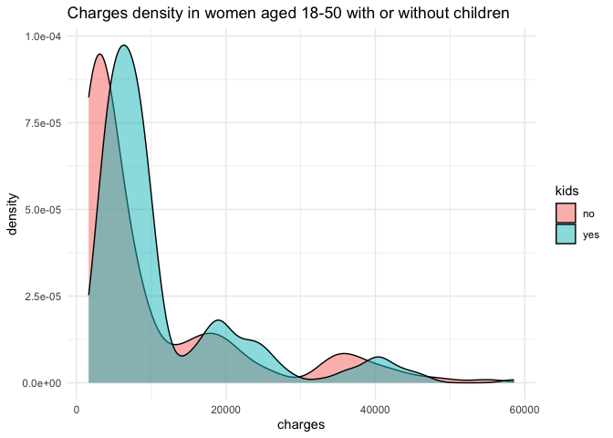
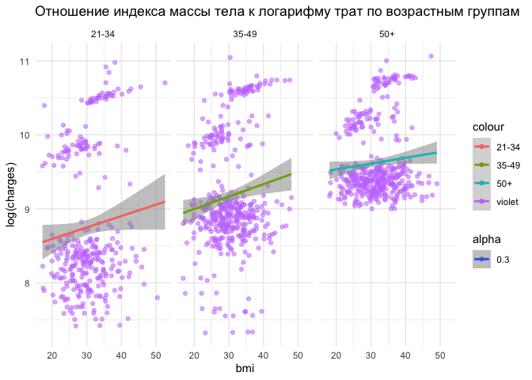

DataViz_HW1_Syrkova
================
2023-11-02

``` r
library(tidyverse)
```

    ## ── Attaching core tidyverse packages ──────────────────────── tidyverse 2.0.0 ──
    ## ✔ dplyr     1.1.2     ✔ readr     2.1.4
    ## ✔ forcats   1.0.0     ✔ stringr   1.5.0
    ## ✔ ggplot2   3.4.2     ✔ tibble    3.2.1
    ## ✔ lubridate 1.9.2     ✔ tidyr     1.3.0
    ## ✔ purrr     1.0.1     
    ## ── Conflicts ────────────────────────────────────────── tidyverse_conflicts() ──
    ## ✖ dplyr::filter() masks stats::filter()
    ## ✖ dplyr::lag()    masks stats::lag()
    ## ℹ Use the conflicted package (<http://conflicted.r-lib.org/>) to force all conflicts to become errors

``` r
library(readxl)
library(openxlsx)
library(dplyr)
library(ggplot2)
library(ggpubr)
library(nortest)
library(skimr)
library(flextable)
```

    ## 
    ## Attaching package: 'flextable'
    ## 
    ## The following objects are masked from 'package:ggpubr':
    ## 
    ##     border, font, rotate
    ## 
    ## The following object is masked from 'package:purrr':
    ## 
    ##     compose

``` r
library(ggbeeswarm)
```

# Задание 1

``` r
read_csv("insurance_cost.csv") -> data_raw
```

    ## Rows: 1338 Columns: 7
    ## ── Column specification ────────────────────────────────────────────────────────
    ## Delimiter: ","
    ## chr (3): sex, smoker, region
    ## dbl (4): age, bmi, children, charges
    ## 
    ## ℹ Use `spec()` to retrieve the full column specification for this data.
    ## ℹ Specify the column types or set `show_col_types = FALSE` to quiet this message.

``` r
data_raw %>%
  glimpse()
```

    ## Rows: 1,338
    ## Columns: 7
    ## $ age      <dbl> 19, 18, 28, 33, 32, 31, 46, 37, 37, 60, 25, 62, 23, 56, 27, 1…
    ## $ sex      <chr> "female", "male", "male", "male", "male", "female", "female",…
    ## $ bmi      <dbl> 27.900, 33.770, 33.000, 22.705, 28.880, 25.740, 33.440, 27.74…
    ## $ children <dbl> 0, 1, 3, 0, 0, 0, 1, 3, 2, 0, 0, 0, 0, 0, 0, 1, 1, 0, 0, 0, 0…
    ## $ smoker   <chr> "yes", "no", "no", "no", "no", "no", "no", "no", "no", "no", …
    ## $ region   <chr> "southwest", "southeast", "southeast", "northwest", "northwes…
    ## $ charges  <dbl> 16884.924, 1725.552, 4449.462, 21984.471, 3866.855, 3756.622,…

# Задание 2 Выведите гистограммы всех нумерических переменных.

``` r
data_raw %>%
  select(where(is.numeric)) %>%
  names() -> num_vars_names


graphs_list_num <- lapply(num_vars_names,
                          function(x){
                            data_raw %>%
                              ggplot() +
                              geom_histogram(aes(x = data_raw[[x]]),
                                          color = "cornsilk2", fill = "dark violet") +
                              theme_bw() +
                              ggtitle(x) +
                              xlab("values")
                          })
num_hist_plot <- ggarrange(plotlist = graphs_list_num, nrow = 1, ncol = 1)
```

    ## `stat_bin()` using `bins = 30`. Pick better value with `binwidth`.
    ## `stat_bin()` using `bins = 30`. Pick better value with `binwidth`.
    ## `stat_bin()` using `bins = 30`. Pick better value with `binwidth`.
    ## `stat_bin()` using `bins = 30`. Pick better value with `binwidth`.

``` r
num_hist_plot
```

    ## $`1`

<!-- -->

    ## 
    ## $`2`

<!-- -->

    ## 
    ## $`3`

<!-- -->

    ## 
    ## $`4`

<!-- -->

    ## 
    ## attr(,"class")
    ## [1] "list"      "ggarrange"

# Задание 3. Нарисуйте график плотности по колонке charges. Отметьте вертикальные линии средней и медианы на графике. Раскрасьте текст и линии средней и медианы разными цветами. Добавьте текстовые пояснения значения средней и медианы. Подберите тему для графика. Назовите оси.

``` r
charges_mean <- round(mean(data_raw$charges),1)
charges_median <- round(median(data_raw$charges),1)

data_raw %>%
  ggplot( aes(x=charges)) +
    geom_density(fill="#99CC66", color="#99CCCC", alpha=0.8) +
    ggtitle("Charges density") +
    labs(x = "Charges", y = "Density") + 
    geom_vline(aes(xintercept = charges_mean), color='blue') +
      annotate("text", x = 20000, y = 0.000055, color='blue', 
             label=paste0("Mean=", charges_mean)) +
    geom_vline(aes(xintercept = charges_median), color ='#FF3333') +
      annotate("text", x = 4000, y = 0.000065, color ='#FF3333', label=paste0("Median=", charges_median)) +
    theme_bw() -> density_plot
density_plot
```

<!-- -->

\#Задание 4 Сделайте три box_plot по отношению переменных charges и (1)
sex (2) smoker (3) region. Подберите тему для графика. Назовите оси.

``` r
data_raw %>%
  select(c(sex, smoker, region)) %>%
  names() -> boxplot_vars


list_boxplot_graphs<- lapply(boxplot_vars,
                          function(x){
                            data_raw %>%
                              ggplot() +
                              geom_boxplot(aes(x = data_raw[[x]], y = `charges`),
                                          color = "339999", fill = "0066CC") +
                              theme_grey() +
                              ggtitle(x) +
                              xlab(x)
                          })
boxplot_graphs <- ggarrange(plotlist = list_boxplot_graphs, nrow = 1, ncol = 1)

boxplot_graphs
```

    ## $`1`

<!-- -->

    ## 
    ## $`2`

<!-- -->

    ## 
    ## $`3`

<!-- -->

    ## 
    ## attr(,"class")
    ## [1] "list"      "ggarrange"

\#Задание 5 Объедините графики из заданий 3 и 4 в один так, чтобы сверху
шёл один график из задания 3, а под ним 3 графика из задания 4. Сделайте
общее название для графика.

``` r
boxplot_graphs2 <- ggarrange(plotlist = list_boxplot_graphs, nrow = 1, ncol = 3, widths=c(1, 1, 2))

plots_density_boxplots <- ggarrange(density_plot, boxplot_graphs2, nrow = 2, ncol = 1)

plots_density_boxplots
```

<!-- -->

# Задание 6 Сделайте фасет графика из задания 3 по колонке region. \#недоделано в задании 3

``` r
data_raw %>%
  ggplot(aes(x=charges)) +
    geom_density(fill="#99CC66", color="#99CCCC", alpha=0.8) +
    ggtitle("Charges density") +
    geom_vline(aes(xintercept = charges_mean), color='blue') +
      #annotate("text", 
             #x=charges_mean+8000, 
             #y=300000,
       #      label=paste0("Mean=", charges_mean))
    geom_vline(aes(xintercept = charges_median), color ='#FF3333') +
     # annotate("text", 
             #x=charges_median-8000, 
             #y=500000,
    #         label=paste0("Mean=", charges_mean))+
    facet_grid(. ~ region) +
    theme_bw()
```

<!-- -->

\#Задание 7 Постройте scatter plot отношения переменных age и charges.
Добавьте названия осей, название графика и тему. Сделайте так, чтобы
числа по оси Х отображались 14 шрифтом.

``` r
data_raw %>%
  ggplot(aes(x=age, y=charges)) +
    geom_point() +
    xlab("age") +
    ylab("charges") +
    ggtitle("Age ~ Charges") +
    theme(axis.title.x = element_text(size=14)) +
    theme_bw()
```

<!-- -->

\#Задание 8 Проведите линию тренда для предыдущего графика.

``` r
data_raw %>%
  ggplot(aes(x=age, y=charges)) +
    geom_point() +
    geom_smooth(method=lm) +
    xlab("age") +
    ylab("charges") +
    ggtitle("Age ~ Charges") +
    theme(axis.title.x = element_text(size=14)) +
    theme_bw()
```

    ## `geom_smooth()` using formula = 'y ~ x'

<!-- -->

# Задание 9 Сделайте разбивку предыдущего графика по колонке smokers (у вас должно получится две линии тренда для курящих и нет).

``` r
data_raw %>%
  ggplot(aes(x=age, y=charges)) +
    geom_point() +
    geom_smooth(method=lm, aes(group = smoker)) +
    xlab("age") +
    ylab("charges") +
    ggtitle("Age ~ Charges") +
    theme(axis.title.x = element_text(size=14)) +
    theme_bw()
```

    ## `geom_smooth()` using formula = 'y ~ x'

<!-- -->

# Задание 10. Сделайте график из заданий 7-9, но вместо переменной age используйте переменную bmi.

``` r
data_raw %>%
  ggplot(aes(x=bmi, y=charges)) +
    geom_point() +
    geom_smooth(method=lm, aes(group = smoker)) +
    xlab("BMI") +
    ylab("charges") +
    ggtitle("BMI ~ Charges") +
    theme(axis.title.x = element_text(size=14)) +
    theme_bw()
```

    ## `geom_smooth()` using formula = 'y ~ x'

<!-- -->

# Задание 11 Самостоятельно задайте вопрос No1 к данным (вопрос должен быть про какую-то подвыборку данных). Ответьте на него построив график на подвыборке данных. График должен содержать все основные элементы оформления (название, подписи осей, тему и проч.). Аргументируйте выбор типа графика.

Вопрос: Есть ли различия в распределнии charges среди женщин возраста
18-50 в заисимости от наличия детей

Выбор типа графика: требуется визуализировать 2 группы (по
категориальной переменной) для 1 количественной переменной. С помощью
density plot можно визуально оценить, одинаковое ли распределение
charges в выбранной популяции для групп без детей и с детьми.

``` r
data_raw %>%
  filter(sex == "female" & between(age, 18, 50)) %>%
  mutate(kids = ifelse((children > 0), 'yes', 'no')) %>%
  ggplot() +
  geom_density(aes(x = charges, fill = kids), 
               alpha = 0.5 
               )+
  ggtitle("Charges density in women aged 18-50 with or without children") +
  theme_minimal()
```

<!-- -->

\#Задание 14

``` r
data_raw %>%
  mutate(charges_log = log(charges)) %>%
  filter(age >= 21) %>%
  mutate(age_group = ifelse((age > 21) & (age < 34 ), '21-34', ifelse(age < 49, '35-49', '50+'))) %>%
  ggplot(aes(x=bmi, y=charges_log, color = "violet", alpha = 0.3)) +
    geom_point() +
    geom_smooth(method=lm, aes(color = age_group)) +
    xlab("bmi") +
    ylab("log(charges)") +
    ggtitle("Отношение индекса массы тела к логарифму трат по возрастным группам") +
    facet_grid(. ~ age_group) +
    theme_minimal()
```

    ## `geom_smooth()` using formula = 'y ~ x'

<!-- -->
